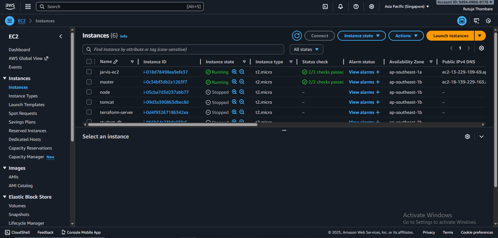
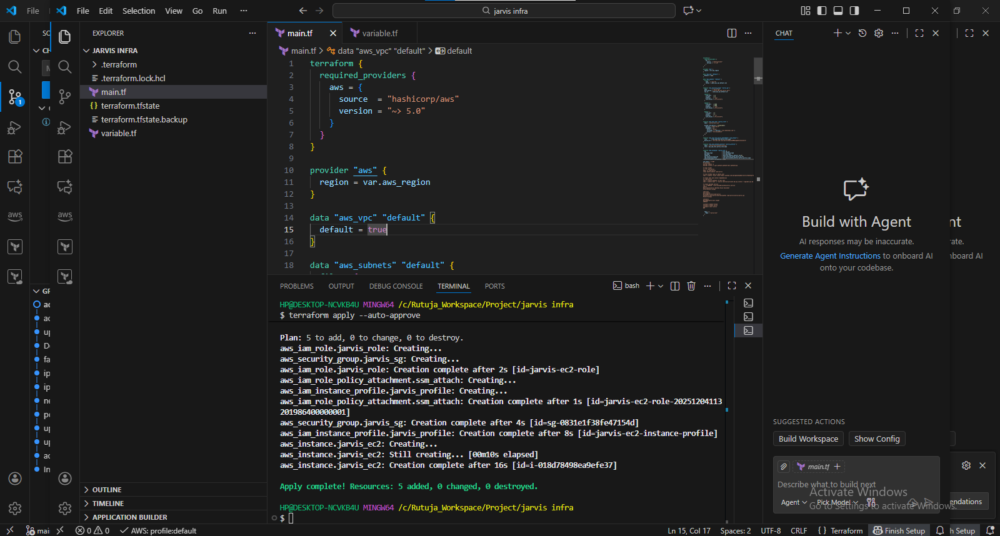
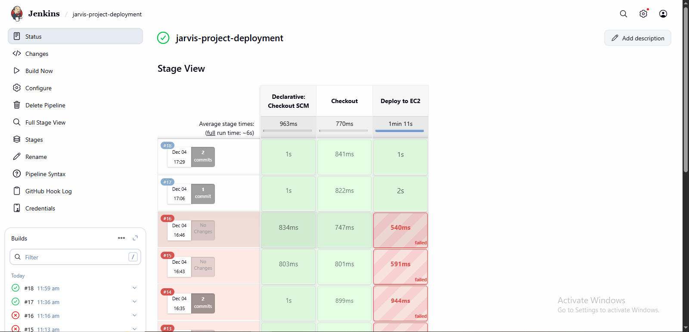
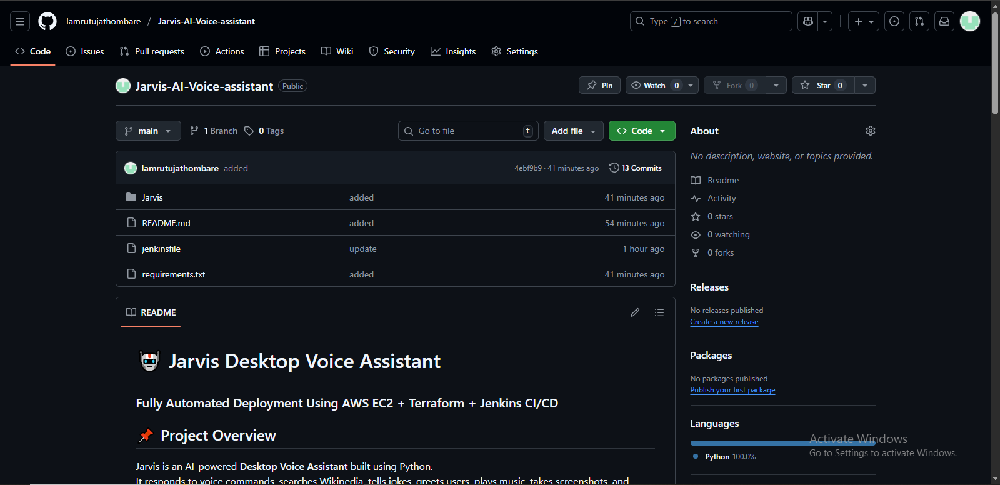

# 🤖 Jarvis AI Voice Assistant — Automated Cloud Deployment
### Powered by **AWS EC2 | Terraform | Jenkins CI/CD**


---

## 🌟 Introduction

Jarvis is an intelligent **Python-based Voice Assistant** capable of performing everyday tasks such as searching the web, telling jokes, giving system information, and more.

This enhanced DevOps version deploys Jarvis using **Terraform**, **Jenkins CI/CD**, and **AWS EC2** for complete automation.

---

## 🚀 What This Project Delivers

- Fully automated infrastructure via **Terraform**
- CI/CD pipeline using **Jenkins + GitHub Webhooks**
- Auto-deployment to AWS EC2 using rsync
- Continuous background execution via **systemd**
- Python virtual environment setup
- Dedicated **server mode** for EC2

---

## 🏗️ Architecture Overview


### Terraform Automates
- EC2 provisioning
- IAM roles
- Security Groups
- Dependency installation
- Auto-start of Jarvis service

### Jenkins Handles
- Webhook triggers
- Code checkout
- Deployment to EC2
- Service restart

---

## 🎤 Jarvis Features

### Desktop Mode
- Text-to-speech
- Speech recognition
- Opens websites & apps
- Plays music
- Takes screenshots
- System control

### Cloud Mode (EC2)
| Feature | Available |
|--------|-----------|
| Time/Date | ✅ |
| Wikipedia | ✅ |
| Jokes | ✅ |
| Mic Input | ❌ |
| Audio Output | ❌ |
| Screenshots | ❌ |

---

## 🧰 Tech Stack

- Python: pyttsx3, speech_recognition, wikipedia, pyjokes, pyautogui
- DevOps: Terraform, Jenkins, AWS EC2, IAM, GitHub, systemd

---

## 📂 Project Structure

```
Jarvis-Automated-Cloud-Deployment/
├── source/
│   └── jarvis_main.py
├── requirements.txt
├── jenkinsfile
├── IMG/
└── README.md
```

---

# ⚙️ Terraform Deployment

```hcl
resource "aws_instance" "jarvis" {
  ami           = var.ami
  instance_type = var.ec2_type
  key_name      = var.ssh_key

  user_data = <<EOF
#!/bin/bash
apt update -y
apt install -y python3 python3-venv python3-pip git

rm -rf /srv/jarvis
git clone https://github.com/Iamrutujathombare/Jarvis-AI-Voice-assistant.git/srv/jarvis

cd /srv/jarvis
python3 -m venv env
source env/bin/activate
pip install -r requirements.txt

cat <<SERVICE >/etc/systemd/system/jarvis.service
[Unit]
Description=Jarvis AI Assistant
After=network.target

[Service]
User=ubuntu
WorkingDirectory=/srv/jarvis
ExecStart=/srv/jarvis/env/bin/python /srv/jarvis/source/jarvis_main.py
Restart=always

[Install]
WantedBy=multi-user.target
SERVICE

systemctl daemon-reload
systemctl enable jarvis
systemctl start jarvis
EOF
}
```

---

## 🔁 Jenkins Pipeline

```groovy
pipeline {
  agent any

  environment {
    HOST = "ubuntu@EC2_IP"
    TARGET_DIR = "/srv/jarvis"
  }

  triggers { githubPush() }

  stages {
    stage('Fetch Code') {
      steps {
        git branch: 'main', url: 'https://github.com/Iamrutujathombare/Jarvis-AI-Voice-assistant.git'
      }
    }

    stage('Deploy to EC2') {
      steps {
        sshagent(['ec2-ssh']) {
          sh """
            rsync -avz --exclude env --delete . ${HOST}:${TARGET_DIR}
            ssh ${HOST} 'sudo systemctl restart jarvis'
          """
        }
      }
    }
  }
}
```

---

## 🔥 Managing the Jarvis Service

```
sudo systemctl restart jarvis
sudo systemctl status jarvis
sudo journalctl -u jarvis -f
```
## 🖼️ Screenshots

| Screenshot | Description |
|-----------|-------------|
|  | Jarvis running on the AWS EC2 instance |
|  | Terraform provisioning AWS resources |
|  | Jenkins CI/CD pipeline executing deployment |
|  | Github Repo |


## 🎓 What We Learned (Key Takeaways)

### 🔹 Cloud (AWS)
- How to launch and configure EC2 instances
- Creating IAM roles & instance profiles
- Setting up and managing Security Groups
- Automating deployments to cloud servers

### 🔹 Terraform
- Writing IaC to create and manage resources
- Using variables and providers effectively
- Automating EC2 setup with `user_data`
- Understanding declarative provisioning

### 🔹 DevOps & CI/CD
- Creating Jenkins Declarative Pipelines
- Configuring GitHub → Jenkins Webhooks
- Using rsync + SSH for automated deployments
- Managing Linux services with systemd

### 🔹 Python Development
- Building a modular Python voice assistant
- Using speech recognition and text-to-speech libraries
- Running Python apps in server-mode without GUI
- Structuring scalable project folders

---

## ✍️ Author
**Rutuja Thombare**

Cloud | DevOps | Python

GitHub: https://github.com/Iamrutujathombare

Email: rutujathombare7387@gmail.com
